# KādoLinguo

## Overview

KādoLinguo is an application to help users enhance language skills through stories and flashcards. Kādo, means ‘card’ in Japanese, and ‘gift' in French. Linguo, is often used as a playful way referring to language-related topics.

KādoLinguo allows users to unwrap and explore “linguistic gifts” consisting of inspiring stories, personalized vocabulary and sentences via flashcards.

This app allows users to access inspiring stories and ready-made flashcards, quiz themselves, and engage in an interactive card pairing game.

### Problem

1. Engaging learning experience:

- Traditional language learning methods can be monotonous and lack engagement.
- KādoLinguo offers a dynamic and interactive learning experience through stories, flashcards, quizzes, and games.
- These elements keep users engaged and motivated, making learning experience more enjoyable.

2. Personalized learning journey _(nice-to-have feature)_:

- One-size-fits-all language learning may not cater to everyone.
- KādoLinguo offers features like flashcard creation which allows users to tailor their learning journey.
- This ensures that users can focus on areas where they need improvement and learn at their own pace.

3. Visual association for better retention:

- Traditional way of memorizing vocabulary and sentences can be challenging without proper context or visual aidds.
- KādoLinguo offers card pairing game to enhance visual association and reinforce vocabulary.
- This can significantly enhance memory retention and make the learning process more effective.

### User Profile

Language learners at all ages can benefit from KādoLinguo.

### Features

1. Stories

- Ready-made stories for language learning with vocabulary words and example sentences.

2. Flashcards

- Users can use the ready-made deck of cards to practice.

3. Quiz Mode

- Implement a quiz mode where users can go through their flashcards and test their knowledge.
- Provide instant feedback on correct/incorrect answers.

4. Card Pairing Game Mode

- Introduce an interactive card pairing game to reinforce vocabulary through visual association.
- Display a grid of cards with images and words, and users need to find matching pairs by selecting two cards consecutively.

## Implementation

### Tech Stack

List technologies that will be used in your app, including any libraries to save time or provide more functionality. Be sure to research any potential limitations.

- React
- Axios
- Node.js
- Express.js
- Database
- Local storage
- Responsive (tablet and desktop)

### APIs

List any external sources of data that will be used in your app.

- Story series with Oli
  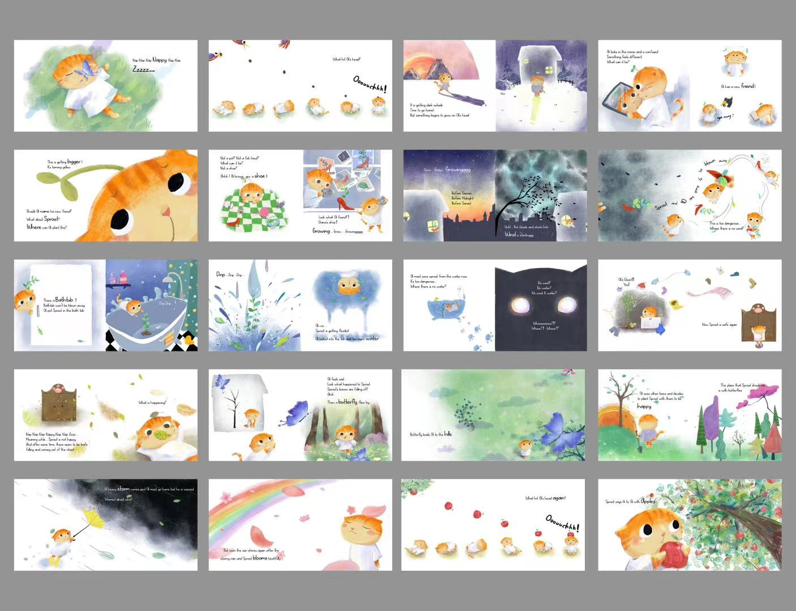

### Sitemap

List the pages of your app with brief descriptions. You can show this visually, or write it out.

- Home Page (header and footer)
  - About
  - Stories
  - Flashcards
    - practice
    - quiz (multiple choice)
    - card pairing game

### Mockups

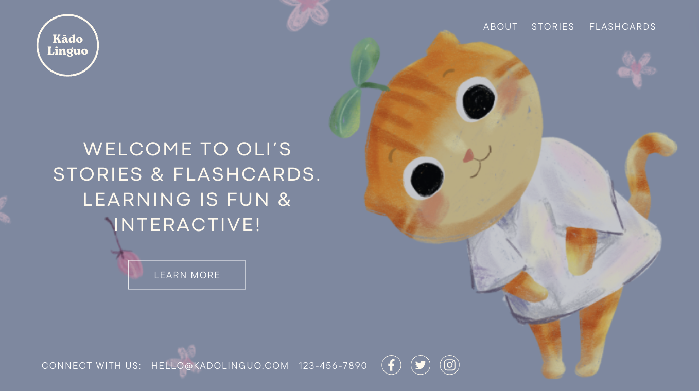
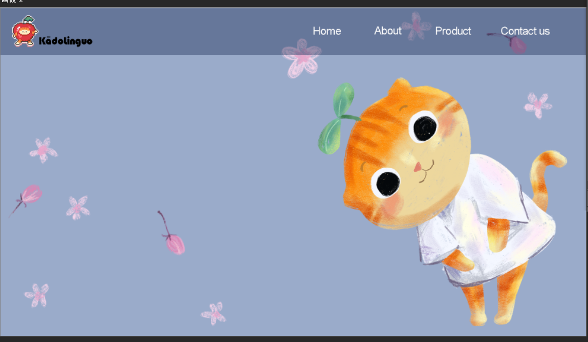
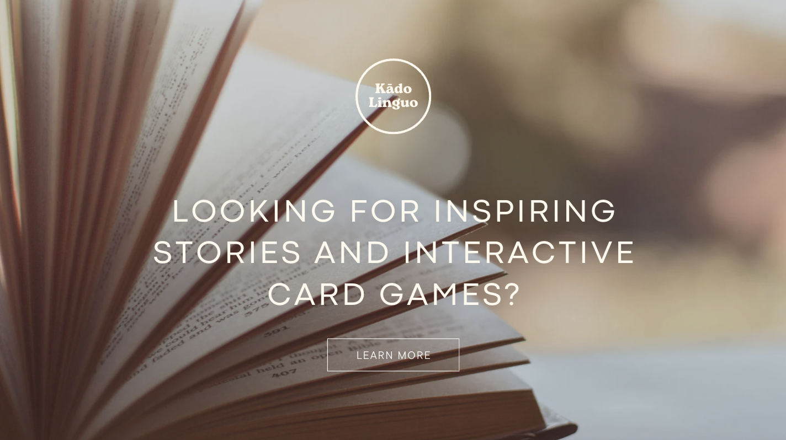
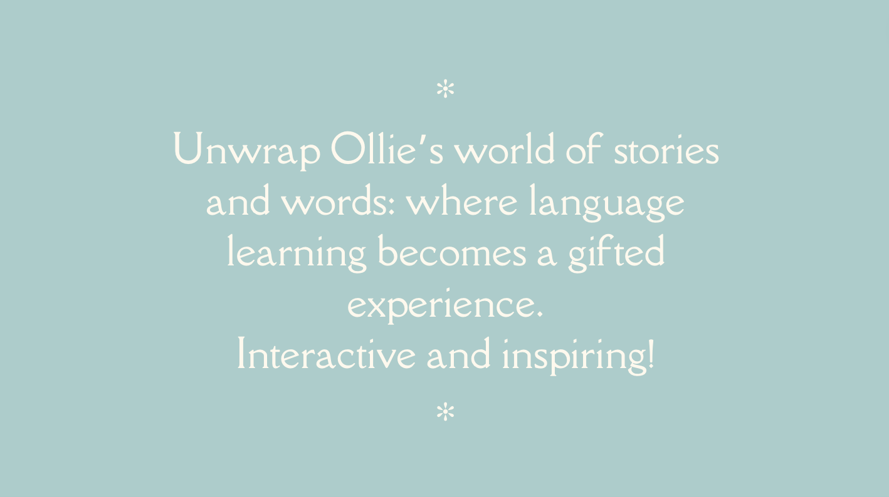
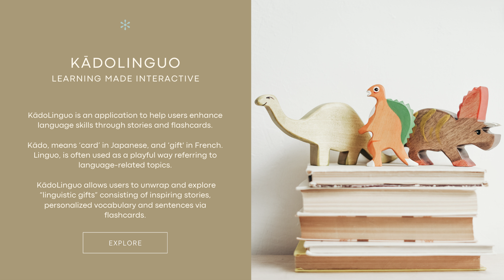
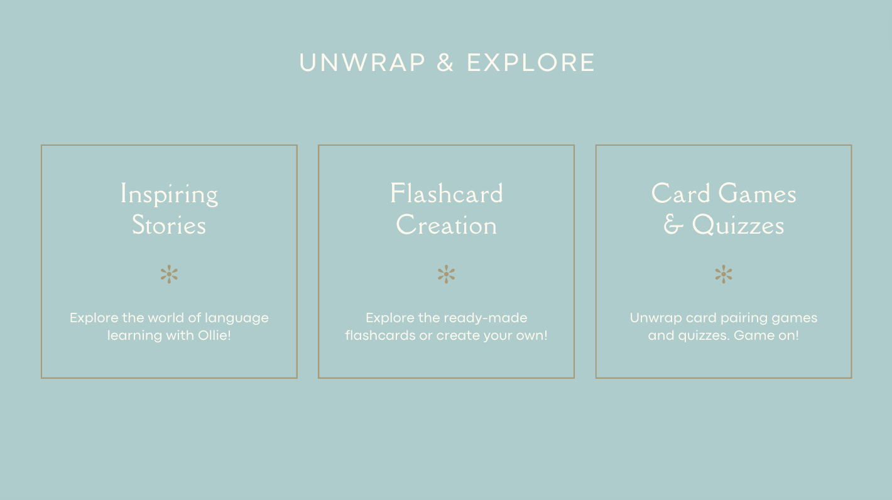
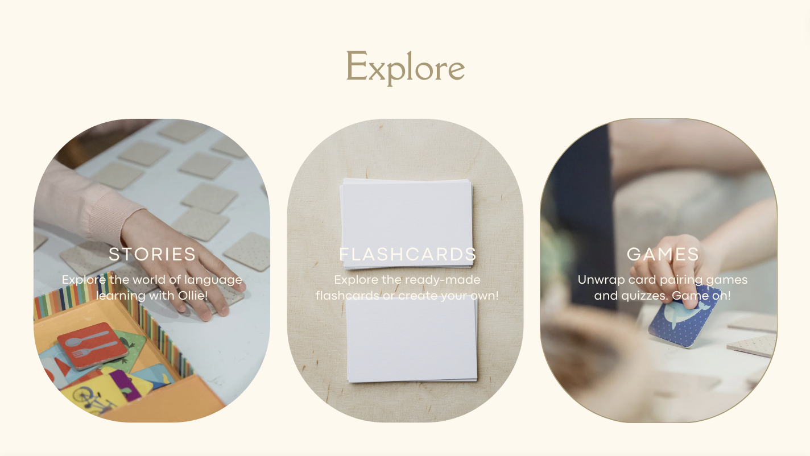
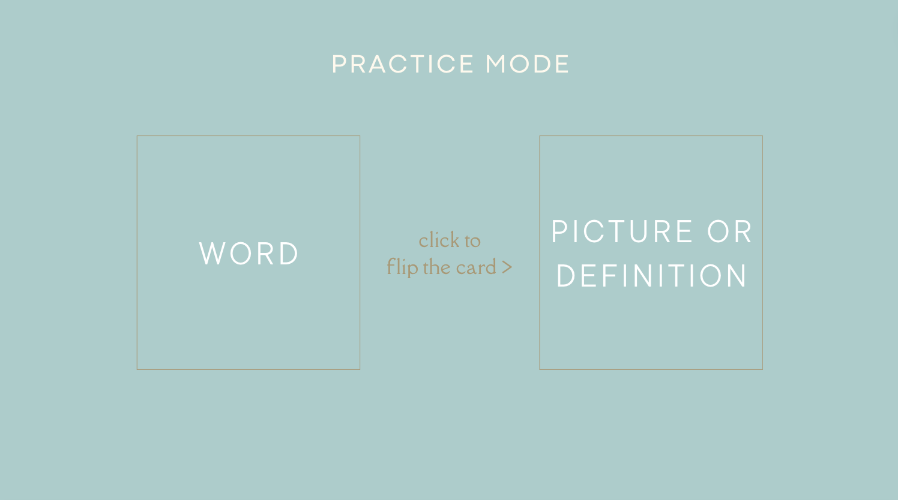
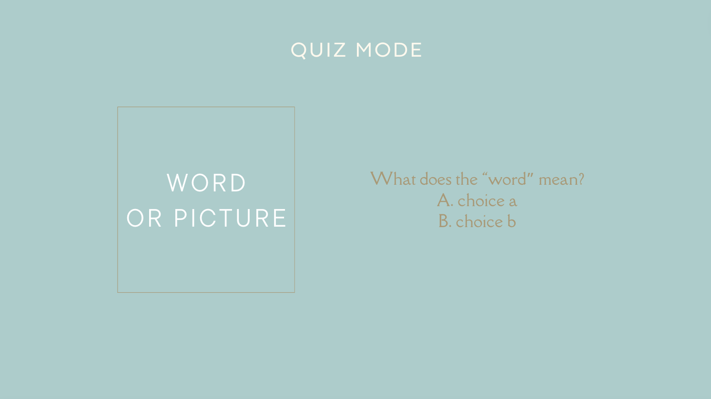

### Cards

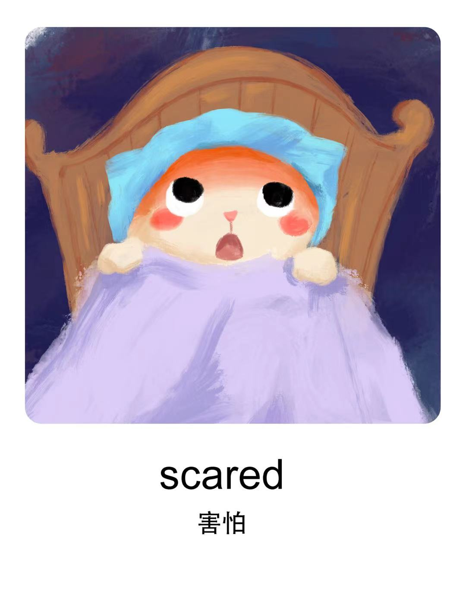

### Data

Describe your data and the relationships between them. You can show this visually using diagrams, or write it out.

### Endpoints

List endpoints that your server will implement, including HTTP methods, parameters, and example responses.

### Auth

Does your project include any login or user profile functionality? If so, describe how authentication/authorization will be implemented.

- Auth is part of the nice-to-have section.

## Roadmap

Scope your project as a sprint. Break down the tasks that will need to be completed and map out timeframes for implementation. Think about what you can reasonably complete before the due date. The more detail you provide, the easier it will be to build.

- Sprint 1: build homepage, about page, mode selection page, connect page, flashcards practice mode and functions, quiz mode and functions
- Sprint 2: build add card and edit card pages, auth, and progress tracking function

## Nice-to-haves

1. Highlighted words/sentences

- Each story includes highlighted vocabulary words/sentences where users an click and navigate to flashcard page.

2. Flashcard Creation

- Users can create new flashcards for personalized experience (word and definition).

3. Progress Tracking

- Develop a progress tracking feature that allows users to monitor their learning achievements over time.
- Display statistics such as quiz scores, completion rates, and improvement trends.

4. Authentication (Login/Sign Up)

- Implement user authentication to enable personalized experiences.
- Users can create accounts, log in, and securely access their personalized decks, progress, and settings.
- Ensure that user data is securely stored and encrypted.
