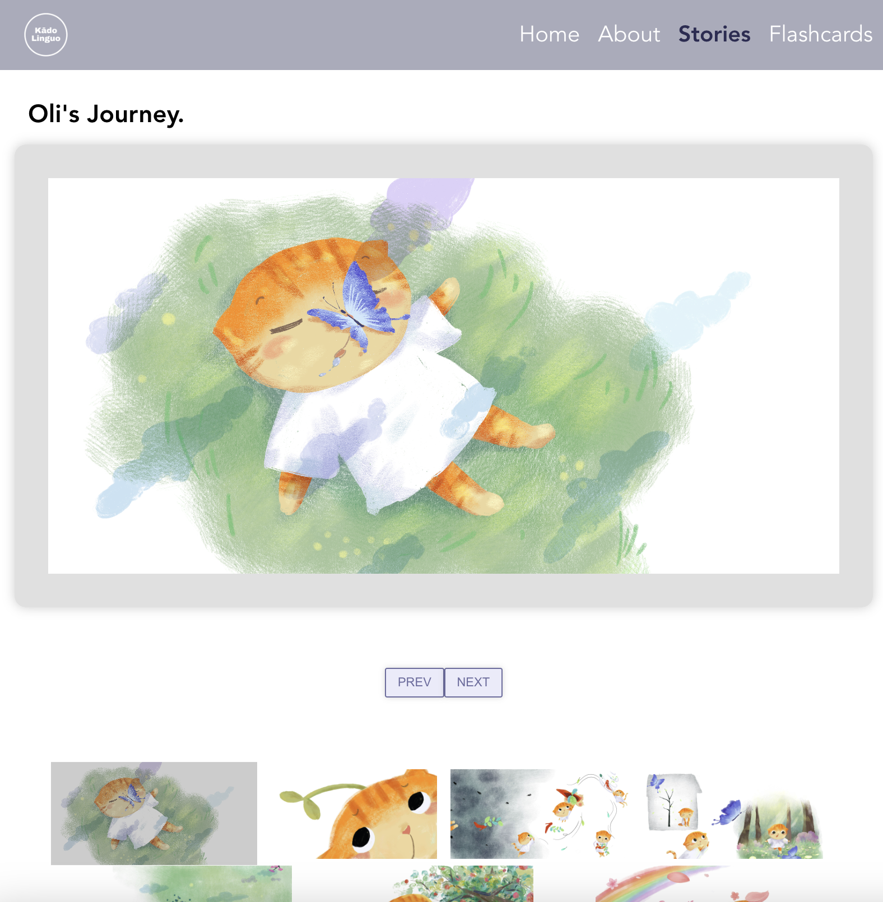

# KādoLinguo

## Overview

KādoLinguo is an application that helps users enhance language skills through stories and flashcards. Kādo, means ‘card’ in Japanese, and ‘gift' in French. Linguo, is often used as a playful way referring to language-related topics.

KādoLinguo allows users to unwrap and explore “linguistic gifts” consisting of inspiring stories, personalized vocabulary and sentences via flashcards.

This app allows users to access inspiring stories and ready-made flashcards, quiz themselves, and engage in an interactive card matching game.

### Problem

1. Engaging learning experience:

- Traditional language learning methods can be monotonous and lack engagement.
- KādoLinguo offers a dynamic and interactive learning experience through stories, flashcards, quizzes, and games.
- These elements keep users engaged and motivated, making learning experience more enjoyable.

2. Personalized learning journey _(nice-to-have feature)_:

- One-size-fits-all language learning may not cater to everyone.
- KādoLinguo offers features like flashcard creation which allows users to tailor their learning journey.
- This ensures that users can focus on areas where they need improvement and learn at their own pace.

3. Visual association for better retention:

- Traditional way of memorizing vocabulary and sentences can be challenging without proper context or visual aidds.
- KādoLinguo offers card matching game to enhance visual association and reinforce vocabulary.
- This can significantly enhance memory retention and make the learning process more effective.

### User Profile

Language learners at all ages can benefit from KādoLinguo.

### Features

1. Stories

- Ready-made stories for language learning with vocabulary words and example sentences.

2. Flashcards

- Users can use the ready-made deck of cards to practice.

3. Quiz Mode

- Implement a quiz mode where users can test their knowledge about story comprehension.
- Provide feedback on the number of correct/incorrect answers.

4. Game Mode

- Introduce an interactive card game to reinforce vocabulary/phrase through visual association.
- Display a grid of cards with images and corresponding words/phrases in the drop box. Users need to find matching pairs by drag-and-drop the images into the drop box.

## Implementation

### Tech Stack

List technologies that will be used in your app, including any libraries to save time or provide more functionality. Be sure to research any potential limitations.

- React
- Axios
- Node.js
- Express.js
- Database
- Responsive

### APIs

List any external sources of data that will be used in your app.

- Story series with Oli
  

### Sitemap

List the pages of your app with brief descriptions. You can show this visually, or write it out.

- Home Page (header and footer)
  - About
  - Stories
  - Flashcards
    - practice
    - quiz (multiple choice)
    - card game

### Mockups

##### Home

### Story

### Cards

##### Practice Mode

##### Quiz Mode

##### Game Mode

### Data

Describe your data and the relationships between them. You can show this visually using diagrams, or write it out.

### Endpoints

List endpoints that your server will implement, including HTTP methods, parameters, and example responses.

### Auth

Does your project include any login or user profile functionality? If so, describe how authentication/authorization will be implemented.

- Auth is part of the nice-to-have section.

## Roadmap

Scope your project as a sprint. Break down the tasks that will need to be completed and map out timeframes for implementation. Think about what you can reasonably complete before the due date. The more detail you provide, the easier it will be to build.

- Sprint 1: build homepage, about page, mode selection page, connect page, flashcards practice mode and functions, quiz mode and functions
- Sprint 2: build add card and edit card pages, auth, and progress tracking function

## Nice-to-haves

1. Highlighted words/sentences

- Each story includes highlighted vocabulary words/sentences where users can click and navigate to flashcard page.

2. Flashcard Creation

- Users can create new flashcards for personalized experience (word and definition).

3. Progress Tracking

- Develop a progress tracking feature that allows users to monitor their learning achievements over time.
- Display statistics such as quiz scores, completion rates, and improvement trends.

4. Authentication (Login/Sign Up)

- Implement user authentication to enable personalized experiences.
- Users can create accounts, log in, and securely access their personalized decks, progress, and settings.
- Ensure that user data is securely stored and encrypted.

# Getting Started with Create React App

This project was bootstrapped with [Create React App](https://github.com/facebook/create-react-app).

## Available Scripts

In the project directory, you can run:

### `npm start`

Runs the app in the development mode.\
Open [http://localhost:3000](http://localhost:3000) to view it in your browser.

The page will reload when you make changes.\
You may also see errors in the console.

### `npm test`

Launches the test runner in the interactive watch mode.\
See the section about [running tests](https://facebook.github.io/create-react-app/docs/running-tests) for more information.

### `npm run build`

Builds the app for production to the `build` folder.\
It correctly bundles React in production mode and optimizes the build for the best performance.

The build is minified and the filenames include the hashes.\
Your app is ready to be deployed!

See the section about [deployment](https://facebook.github.io/create-react-app/docs/deployment) for more information.

### `npm run eject`

**Note: this is a one-way operation. Once you `eject`, you can't go back!**

If you aren't satisfied with the build tool and configuration choices, you can `eject` at any time. This command will remove the single build dependency from your project.

Instead, it will copy all the configuration files and the transitive dependencies (webpack, Babel, ESLint, etc) right into your project so you have full control over them. All of the commands except `eject` will still work, but they will point to the copied scripts so you can tweak them. At this point you're on your own.

You don't have to ever use `eject`. The curated feature set is suitable for small and middle deployments, and you shouldn't feel obligated to use this feature. However we understand that this tool wouldn't be useful if you couldn't customize it when you are ready for it.

## Learn More

You can learn more in the [Create React App documentation](https://facebook.github.io/create-react-app/docs/getting-started).

To learn React, check out the [React documentation](https://reactjs.org/).

### Code Splitting

This section has moved here: [https://facebook.github.io/create-react-app/docs/code-splitting](https://facebook.github.io/create-react-app/docs/code-splitting)

### Analyzing the Bundle Size

This section has moved here: [https://facebook.github.io/create-react-app/docs/analyzing-the-bundle-size](https://facebook.github.io/create-react-app/docs/analyzing-the-bundle-size)

### Making a Progressive Web App

This section has moved here: [https://facebook.github.io/create-react-app/docs/making-a-progressive-web-app](https://facebook.github.io/create-react-app/docs/making-a-progressive-web-app)

### Advanced Configuration

This section has moved here: [https://facebook.github.io/create-react-app/docs/advanced-configuration](https://facebook.github.io/create-react-app/docs/advanced-configuration)

### Deployment

This section has moved here: [https://facebook.github.io/create-react-app/docs/deployment](https://facebook.github.io/create-react-app/docs/deployment)

### `npm run build` fails to minify

This section has moved here: [https://facebook.github.io/create-react-app/docs/troubleshooting#npm-run-build-fails-to-minify](https://facebook.github.io/create-react-app/docs/troubleshooting#npm-run-build-fails-to-minify)
